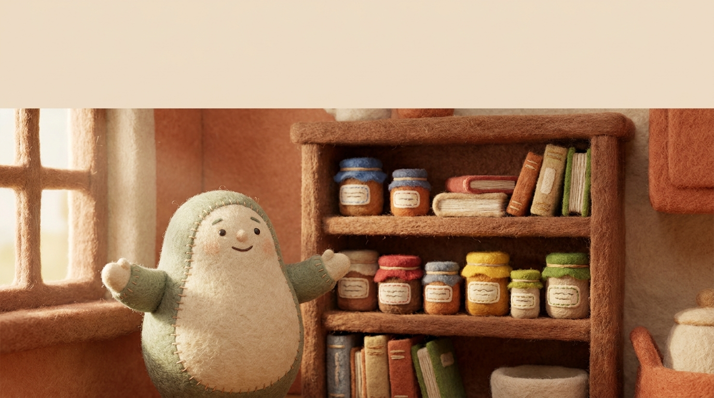
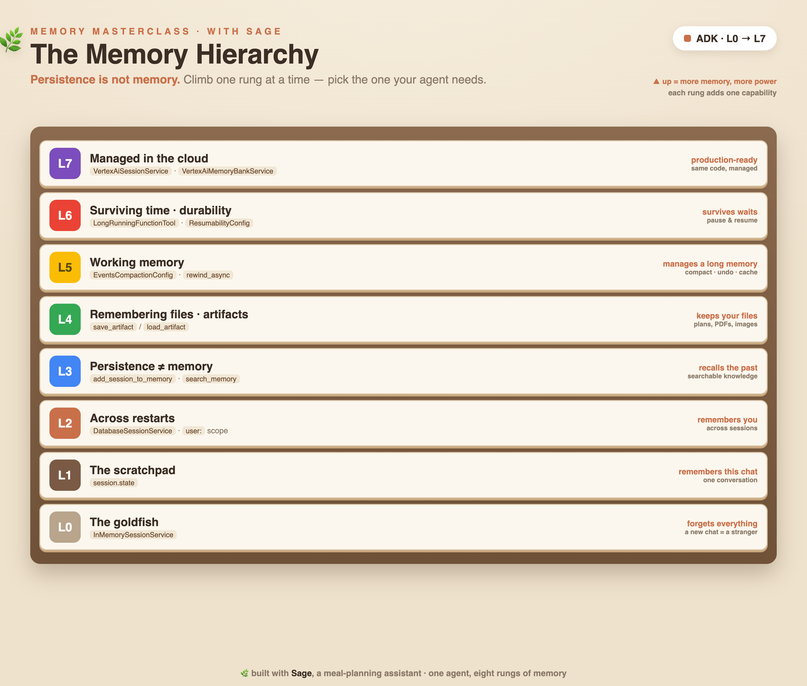

author: Annie Wang (cuppibla)
summary: Give your ADK agent a memory. Climb the Memory Hierarchy — session state, persistent sessions, long-term memory, artifacts, context management, durability, and managed cloud — through one meal-planning assistant, Sage.
id: sage-memory-masterclass
categories: ai,adk,agents,gemini,memory
environments: Web
status: Draft
feedback link: https://github.com/cuppibla/adk-memory-masterclass/issues

# The ADK Memory Masterclass 🌿

## Overview
Duration: 3:00



Ask an AI agent for dinner ideas on Monday — *"I'm vegetarian, no mushrooms"* — and come
back Wednesday. Most agents greet you like a stranger. They have no memory.

"Memory" for an agent isn't one thing, though. It's a **hierarchy** — a stack of very
different mechanisms, from a one-conversation scratchpad to searchable long-term knowledge to
managed cloud stores. Knowing which rung you need is the difference between an agent that feels
alive and one that's a goldfish (or one that's needlessly over-engineered).

In this masterclass you'll build **Sage**, a meal-planning assistant, and climb the whole
hierarchy one rung at a time with Google's **Agent Development Kit (ADK)**.



### What you'll learn

- The **Memory Hierarchy** and the one line that unlocks it: **"persistence is not memory."**
- `session.state` — the within-conversation scratchpad.
- `DatabaseSessionService` + the `user:` scope — remembering *you* across sessions and restarts.
- Long-term, searchable **memory** (`add_session_to_memory` / `search_memory`).
- **Artifacts** — remembering files.
- **Context management** — compaction, rewind, caching for long chats.
- **Durability** — pausing and resuming long-running work.
- Taking it to **managed cloud** (Vertex sessions + Memory Bank) with zero code changes.

### How this codelab works

Everything runs in **two Google Colab notebooks** — zero local setup. This codelab is your
guide: each step explains the *why*, then sends you to the matching notebook section to run it.

- **▶ [Notebook 1 — Remembering](https://colab.research.google.com/drive/1V7I1LHZk_IxcvKkEdTKFkwC35OBNK-cp)** (L0–L4)
- **▶ [Notebook 2 — Managing Memory](https://colab.research.google.com/drive/1bJZZz6LKF7Z5OM5eaFZCf4zZMMu795ET)** (L5–L7)

Prefer to clone and edit? Everything's on GitHub too:
[github.com/cuppibla/adk-memory-masterclass](https://github.com/cuppibla/adk-memory-masterclass).

## Setup
Duration: 3:00

👉 **Open Notebook 1:**
[Sage · Part 1 — Remembering](https://colab.research.google.com/drive/1V7I1LHZk_IxcvKkEdTKFkwC35OBNK-cp)

👉 In the notebook, run the **⚙️ Setup** cell. It installs ADK and asks for a **Gemini API
key** (get one at [aistudio.google.com/apikey](https://aistudio.google.com/apikey); in Colab,
store it in **Secrets** as `GOOGLE_API_KEY`).

👉 Then run the **🌿 shared Sage base** cell once — it defines Sage's tools and a tiny
`say()` helper the rest of the notebook uses.

Now you're ready to climb.

## L0 · The goldfish 🐟
Duration: 5:00

The default agent is a **goldfish**. Sage here runs on an `InMemorySessionService` — all state
lives in RAM for one session. Within a single chat it's fine, but open a **new session** and
it has forgotten you completely.

> ℹ️ **Why start here?** To feel the problem. Every rung above exists to fix some version of
> "it forgot."

▶ **Run it:** [**notebook Section L0** ▸](https://colab.research.google.com/drive/1V7I1LHZk_IxcvKkEdTKFkwC35OBNK-cp#scrollTo=l0)  ·  📂 code: [`L0_goldfish/`](https://github.com/cuppibla/adk-memory-masterclass/tree/main/L0_goldfish). You'll see Chat A learn that Alice is vegetarian, and
Chat B — a brand-new session — draw a total blank:
> 🌿 *"I don't have any preferences saved for you yet!"*

**❌ A new session is a stranger.** Sage needs somewhere to keep what it learns. → L1

## L1 · The scratchpad — session.state 📝
Duration: 6:00

The simplest memory is a **scratchpad that lives for one conversation**. When Sage learns
something, its `note_preference` tool writes to `session.state`; later turns in that same chat
read it back.

```python
def note_preference(preference, tool_context):
    prefs = list(tool_context.state.get("preferences", []))
    prefs.append(preference)
    tool_context.state["preferences"] = prefs   # ← the scratchpad
```

▶ **Run it:** [**notebook Section L1** ▸](https://colab.research.google.com/drive/1V7I1LHZk_IxcvKkEdTKFkwC35OBNK-cp#scrollTo=l1)  ·  📂 code: [`L1_scratchpad/`](https://github.com/cuppibla/adk-memory-masterclass/tree/main/L1_scratchpad). Turn 1 tells Sage "vegetarian, no mushrooms"; turn 2
asks what to cook and Sage answers *"lentil curry — mushroom-free!"*

**✅ Within a conversation, Sage remembers.** But it's still one session — a new chat forgets
again. We need to *persist* and *scope* that state. → L2

## L2 · Remember across restarts — DatabaseSessionService + user: scope 💾
Duration: 8:00

Two ideas at once:

1. **A database session service** persists state to disk, so it survives a process restart.
2. The **`user:` prefix** scopes a value to the *user* — shared across all their sessions.

```python
session_service = DatabaseSessionService(db_url="sqlite+aiosqlite:///./sage.db")
# ...
tool_context.state["user:preferences"] = prefs   # note the user: prefix
```

> ⚠️ **Gotcha:** `DatabaseSessionService` uses an **async** driver — `sqlite+aiosqlite://`
> locally (and `postgresql+asyncpg://` for Cloud SQL). Not the sync drivers.

▶ **Run it:** [**notebook Section L2** ▸](https://colab.research.google.com/drive/1V7I1LHZk_IxcvKkEdTKFkwC35OBNK-cp#scrollTo=l2)  ·  📂 code: [`L2_persistence/`](https://github.com/cuppibla/adk-memory-masterclass/tree/main/L2_persistence). Monday Alice sets her prefs; Tuesday a *fresh* service +
new session still greets her with a quick vegetarian suggestion.

**✅ A new session on a fresh service still knows Alice.** But state only remembers *facts you
set*. What about *what happened*? → L3

## L3 · Persistence ≠ memory 🧠
Duration: 8:00

Here's the sentence to tattoo on your brain: **persistence is not memory.**

- **State** (L1/L2) is a durable *transcript / key-value* — facts you explicitly saved.
- **Memory** is *searchable knowledge distilled from past conversations* — "what did Alice
  think of the curry three weeks ago?"

You save a finished session to long-term memory, then in a new session **search** it.

> 💡 **Build tip (learned the hard way):** don't just hand the model raw recalled text and hope
> it uses it. A `before_agent_callback` searches memory and **injects** the facts into
> `state`, which the instruction then references — reliable every time.

```python
async def recall_into_state(callback_context):   # param MUST be named callback_context
    resp = await callback_context.search_memory("the user's past meals, likes, dislikes")
    callback_context.state["recalled"] = summarize(resp)
```

▶ **Run it:** [**notebook Section L3** ▸](https://colab.research.google.com/drive/1V7I1LHZk_IxcvKkEdTKFkwC35OBNK-cp#scrollTo=l3)  ·  📂 code: [`L3_memory/`](https://github.com/cuppibla/adk-memory-masterclass/tree/main/L3_memory). Last week Alice loved the lentil curry and hated the
mushroom risotto; this week, in a brand-new session, Sage recalls it and suggests the curry.

**✅ Long-term memory recalls a fact from a past session.** → L4

## L4 · Remembering files — artifacts 📎
Duration: 6:00

State and memory hold text. **Artifacts** hold *files* — a saved meal plan, a shopping-list
PDF, an image. Sage saves a plan as a `user:`-scoped artifact and re-opens it later.

```python
part = types.Part(inline_data=types.Blob(mime_type="text/plain", data=plan.encode()))
await tool_context.save_artifact("user:meal_plan.txt", part)
# … later, even in a new session …
art = await tool_context.load_artifact("user:meal_plan.txt")
```

> 💡 In production, swap `InMemoryArtifactService` → `GcsArtifactService` — the tool code is
> identical.

▶ **Run it:** [**notebook Section L4** ▸](https://colab.research.google.com/drive/1V7I1LHZk_IxcvKkEdTKFkwC35OBNK-cp#scrollTo=l4)  ·  📂 code: [`L4_artifacts/`](https://github.com/cuppibla/adk-memory-masterclass/tree/main/L4_artifacts). Session 1 generates and saves a plan; session 2 re-opens
the exact file.

**✅ Files persist and re-load across sessions.** That's the "Remembering" half. Time to
*manage* all this memory. → open Notebook 2.

## Open Notebook 2 · Managing Memory
Duration: 2:00

👉 **Open Notebook 2:**
[Sage · Part 2 — Managing Memory](https://colab.research.google.com/drive/1bJZZz6LKF7Z5OM5eaFZCf4zZMMu795ET)

Run its **⚙️ Setup** and **🌿 Sage base** cells (same as before), then continue below.

## L5 · Working memory — compaction, rewind & caching 🗜️↩️
Duration: 8:00

The context window is Sage's **short-term working memory**. On a long chat it grows, gets
expensive, and drifts. Three tools keep it healthy:

- **Compaction** (`EventsCompactionConfig`) — periodically summarizes older turns so the chat
  stays affordable. The summary lands as a compaction event you can inspect.
- **Rewind** (`Runner.rewind_async`) — undo a turn, rolling `state` back.
- **Context caching** (`ContextCacheConfig`) — a transparent cost/latency optimization (nothing
  visible to run, but worth knowing).

▶ **Run it:** [**notebook Section L5** ▸](https://colab.research.google.com/drive/1bJZZz6LKF7Z5OM5eaFZCf4zZMMu795ET#scrollTo=l5)  ·  📂 code: [`L5_context/`](https://github.com/cuppibla/adk-memory-masterclass/tree/main/L5_context). Watch a long chat get summarized, then a plan change get
undone: *mushroom soup → (rewind) → lentil curry.*

**✅ Long chats stay manageable; mistakes are reversible.** → L6

## L6 · Surviving time — durability ⏳
Duration: 7:00

Some memory has to survive *time* — a task that pauses for a human or an external event and
resumes later. Sage's grocery order is a **`LongRunningFunctionTool`**: it returns *pending*,
the run **ends**, and it resumes when the user confirms.

```python
tools=[LongRunningFunctionTool(order_groceries)]
app = App(..., resumability_config=ResumabilityConfig(is_resumable=True))
```

▶ **Run it:** [**notebook Section L6** ▸](https://colab.research.google.com/drive/1bJZZz6LKF7Z5OM5eaFZCf4zZMMu795ET#scrollTo=l6)  ·  📂 code: [`L6_durability/`](https://github.com/cuppibla/adk-memory-masterclass/tree/main/L6_durability). The order pauses for confirmation, the run ends, then
resumes on confirmation → *"the order is placed."*

> 🔗 **Go deeper:** the full crash-and-restart story (survive a kill, never double-act) is its
> own lab — [The Long-Running Agent](https://github.com/cuppibla/loop-lab-onboarding).

**✅ A long-running task paused and resumed later.** → L7

## L7 · Managed in the cloud — Vertex sessions + Memory Bank ☁️
Duration: 6:00

The payoff of the whole hierarchy: **the Sage code doesn't change to go to production — only
the services swap.**

```python
# local (L2/L3)                 # managed (L7)
DatabaseSessionService   →  VertexAiSessionService(project, location, agent_engine_id)
InMemoryMemoryService    →  VertexAiMemoryBankService(project, location, agent_engine_id)
```

You get managed sessions and Memory Bank with nothing to run or back up. This step needs a GCP
project + an Agent Engine instance; **everything above runs with no cloud at all.**

▶ **Run it (optional):** [**notebook Section L7** ▸](https://colab.research.google.com/drive/1bJZZz6LKF7Z5OM5eaFZCf4zZMMu795ET#scrollTo=l7)  ·  📂 code: [`L7_managed/`](https://github.com/cuppibla/adk-memory-masterclass/tree/main/L7_managed). Without cloud configured it prints the setup
steps; with a project set, the same Sage runs on managed Vertex services.

## Recap
Duration: 3:00

You climbed the whole Memory Hierarchy:

| Rung | Concept | ADK piece |
|---|---|---|
| within a turn | stateless | `Runner` + `InMemorySessionService` |
| within a chat | scratchpad | `session.state` |
| across chats | durable + scoped | `DatabaseSessionService` · `user:` |
| long-term | searchable memory | `add_session_to_memory` / `search_memory` |
| files | artifacts | `save/load_artifact` |
| working memory | compaction · rewind · caching | `EventsCompactionConfig` · `rewind_async` |
| surviving time | durability | `ResumabilityConfig` · `LongRunningFunctionTool` |
| managed | zero-infra | `VertexAiSessionService` + `VertexAiMemoryBankService` |

**The one thing to remember:** *persistence is not memory.* Pick the rung your agent actually
needs — no more, no less.

### Where to go next
- **The Long-Running Agent** — durability, in depth: [loop-lab-onboarding](https://github.com/cuppibla/loop-lab-onboarding)
- ADK docs: [adk.dev](https://adk.dev)
- This repo: [github.com/cuppibla/adk-memory-masterclass](https://github.com/cuppibla/adk-memory-masterclass)
